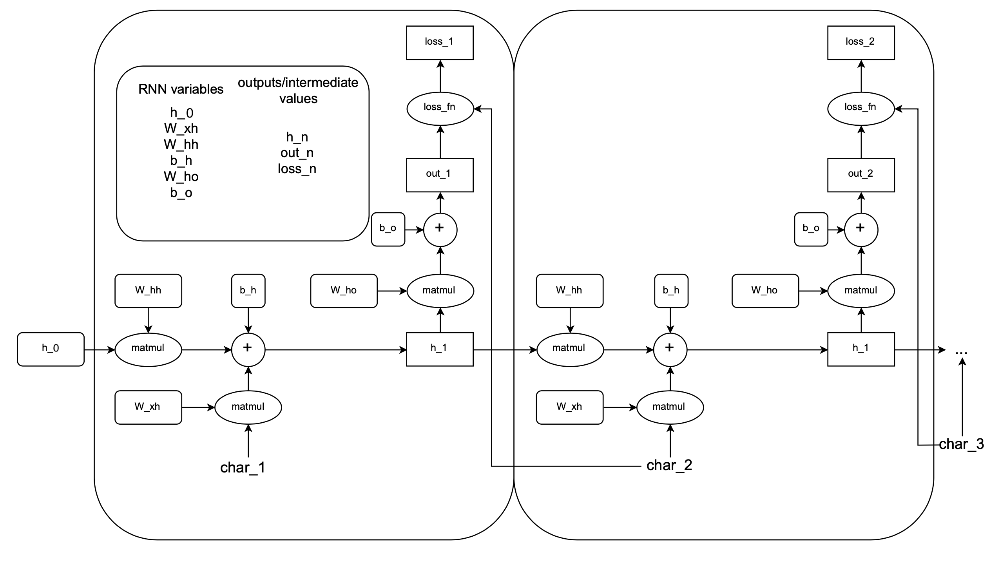

# Assignment 5: Language Modeling & Recurrent Neural Networks
**Deadline: November 30th, 11am**

In this task, you will tackle the task of language modeling using RNNs.
Language Modeling forms an important basis for most NLP applications such as
tagging, parsing or machine translation. However, it can also be used on its
own to generate "natural" language.

**NOTE:** This and the next assignment will be quite wordy. This basically
replaces the usual extra readings of official Tensorflow tutorials. **If you
have questions or run into trouble, use Gitlab or Mattermost!**

**WARNING:** Training with RNNs will take significantly longer than with previous architectures of similar or even larger sizes.   
Make sure to begin working on the assignment early!


## Language Modeling

A *language model* assigns a probability (or, more generally, some kind of
score) to a piece of text. Most of the time, this is done by interpreting the
text as a sequence of words and computing probabilities of each word given the
previous ones. Check out
[this Wikipedia article](https://en.wikipedia.org/wiki/Language_model) for a
quick overview, especially on the classic *n-gram* models.

A consequence of having a probability distribution over words given previous
words is that we can *sample* from this distribution. This way, we can generate
whole sequences of language (usually of questionable quality and sense).

Language Modeling can also be done on a character level, however. That is, the
text is predicted character-for-character instead of word-for-word. *n*-gram
models quickly fail here due to their limited context. RNNs offer a compelling
alternative due to their memory reaching back an arbitrary amount of time (in
theory). Check out
[this "famous" blog post by Andrej Karpathy](http://karpathy.github.io/2015/05/21/rnn-effectiveness/)
to get an impression of what can be done here.

The basic idea is that we train the RNN to predict the next element of a
sequence given the previous elements. That is, at each time step the RNN
receives a character as input. From this input and its current state, it
computes a new state and produces a probability distribution over the next
character. Later, we can generate sequences by sampling single elements from
the RNN's output probability distribution and feeding them back into the
network as input.


## RNNs in Tensorflow

A Tensorflow RNN "layer" can be
confusing due to its black box character: All computations over a full sequence
of inputs are done internally. **To make sure you understand how an RNN "works",
you are asked to implement one from the ground up, defining variables yourself
and using basic operations such as `tf.matmul` to define the computations at
each time step and over a full input sequence.** There are some related tutorials
available on the TF website, but all of these use Keras.

For this
assignment, you are asked **not** to use the `RNNCell` classes nor any related Keras
functionality. Instead, you should study the basic RNN equations and "just"
translate these into code. You can still use Keras optimizers, losses etc. as
well as `Dense` layers if you wish.  
You might want to proceed as follows:

- Download [this helper file for preparing datasets](https://ovgu-ailab.github.io/idl2020w/assignments/5/prepare_data.py).
It provides functions to process text files into a "TFRecords" dataset. Some
text corpora (as well as pointers to more resources) can be found
[here](http://cs.stanford.edu/people/karpathy/char-rnn/). The TFRecords format
is the "recommended" data format to be used with Tensorflow.
You don't need to know how the format works for
this assignment, but reading through the processing code should give you a
rudimentary understanding. If you want to know more, there is a tutorial
[here](https://www.tensorflow.org/tutorials/load_data/tfrecord).  
- The processing function will actually split your text into character
sequences of equal length (try 100 or 200 as a starting point). This means that
any dependencies in between those sequences will be lost, as they will be
presented as independent examples to the RNN (although this effect can be
lessened by supplying an _overlap_). Also, sequences will usually start in the
middle of a sentence (or even word). This is unfortunate, but makes the task
**much** simpler. The function will also store each character as an index that actually
represents a one-hot vector of "features". I.e. at each time step the features
serving as input to the RNN are one-hot vectors signifying the presence of a
certain character.
- To get an understanding of how to actually _use_ the dataset, have another
look at [the dataset guide](https://www.tensorflow.org/guide/data) on
the Tensorflow website. In particular, look at how to consume TFRecord data and
how to parse `tf.Example` protobufs. Basically, all you need to do is create a
`TFRecordDataset` and map this via the `parse_seq` function we provide.

#### Running preprocessing and loading data
First preprocess your downloaded corpus (see above) with the helper file (also see above).
- `python prepare_data.py shakespeare.txt skp`  (with `skp` being how you like to call the output files).
- In the jupyter environment (assuming you're in the right working directory) you can run `!python prepare_data.py shakespeare.txt skp`.
- (you can change the sequence length with an additional `-l` argument)

Preprocessing creates a `skp.tfrecords` file (the data, not human-readable) and a `skp_vocab` file (the vocabulary, pickle serialized, not human-readable). You will use those files to train your RNN.  
Loading is done like this:

```
from prepare_data import parse_seq
import pickle

# this is just a datasets of "bytes" (not understandable)
data = tf.data.TFRecordDataset("skp.tfrecords")

# this maps a parser function that properly interprets the bytes over the dataset
# (with fixed sequence length 200)
# if you change the sequence length in preprocessing you also need to change it here
data = data.map(lambda x: parse_seq(x, 200))

# a map from characters to indices
vocab = pickle.load(open("skp_vocab", mode="rb"))
vocab_size = len(vocab)
# inverse mapping: indices to characters
ind_to_ch = {ind: ch for (ch, ind) in vocab.items()}

print(vocab)
print(vocab_size)
```

#### Building the architecture
Having prepared the data, build an RNN as follows.  
This computation graph for 2 time steps helps you figuring out which variables and ops to implement.  


- Expand your data from indices into one-hot vectors (`tf.one_hot()`). The necessary depth is the vocab_size we already obtained
from the vocabulary file. Your input is turned from `batch_size x seq_len` into `batch_size x seq_len x vocab_size`.
- Set up the variables for computing one time step of the RNN. In our case each time step processes one character. You will need
weights/biases to go from input to hidden, hidden to hidden and hidden to
output. You also need to set up an initial state -- this could be a constant
(e.g. all zeros) or another trainable variable. **Food for thought**: Given that
the data processing adds a "beginning of sequence" character to all sequences,
is there any use for a trainable initial state?
- Iterate over the time axis of your input (simply with a Python for-loop) and
do the RNN computations for each step: Compute the new state given the old
state and the current input, and from this compute the output (logits). Question:
What's the difference between `for time_step in range(n_time_steps)` and
`for time_step in tf.range(n_time_steps)`?
- Compute the softmax loss between the output and the target at this time step.
Keep in mind that _the targets are just the input shifted by one time step_.
- You might be tempted to use Python lists for storing the losses per time step. Lists will not work well with Tensorflow, especially with `@tf.function`.  
The Tensorflow analogue is called TensorArray, which can be called with `dynamic_size=True`, or better, with a pre-allocated size.
- Either sum or average the loss over time. Which option do you think is
preferable and why?
- Compute the gradients of this "sequence loss", i.e. backpropagate through the
_whole sequence_.
- You can use `@tf.function` to wrap the whole loop over time, which should speed
up things significantly.


For now you might be happy with just training the RNN. Experiment with
different layer sizes or sequence lengths. As a reference, an average loss of
~1.5 should be achievable on the Shakespeare corpus using length-200 sequences,
with 512 hidden units (batch size 128 and Adam optimizer, 20 or so epochs).
Training might take a while -- it's okay to shoot for values around 2.0 instead
as a start. If you're feeling fancy, you could even construct a "deep" RNN
(stacking multiple RNN layers) or implement more advanced architectures such as
LSTMs or GRUs, but these will appear in the next assignment anyway.


## Generating Language

Having trained an RNN, you can **use it to generate language** -- technically,
you're "sampling from the language model". To do this, you should:
- Extend your RNN with a softmax output activation applied to the logits so that
it outputs probability distributions.
- Generate a probability distribution over the next character. Feed as input
the last character as well as the current state. To start this process, the
"last" character should be `<S>` (the beginning-of-sequence character inserted
when creating the dataset) and the "last state" whatever you chose as initial
state. Make sure to
output the resulting state along with the probabilities so you can feed it into
the network for the next step.
- Sample from the probability distribution (e.g. using `np.random.choice`) (Food for thought: Could you also use `argmax`?). This
will give you an index that you can feed back as input into the network for the
next step. Also, you can map this to a character using the vocabulary file.
- Repeat this process for as long as you want, maybe for several hundred
characters. Join all the characters into a single string and look at your
output. Note that even if your network was only trained on sequences of a certain
length, you can keep this process going for much longer -- although your
network might not be able to handle it.

Assuming your network was trained properly and your generation process works,
the output should at least superficially resemble the training data. For
example, in the case of Shakespeare you should see a dialogue structure with
proper use of newlines and whitespace. Depending on how long you trained, the
text itself should hopefully "look like" English, although there will likely be
plenty of fantasy words. This is not a problem per se -- chances are the task
is just too difficult for this simple network. Still, if your output looks completely
jumbled, there is probably something wrong with your generation process.

## What to hand in
- low-level implementation of a RNN   
  (training with a custom loop because you won't get a keras model)
- generating sequences from your trained network

**Important:** Your solution does not need to be perfect to be accepted!  
If some parts (this time, for example, generating sequences) do not work, comment on what you tried to fix it.  
